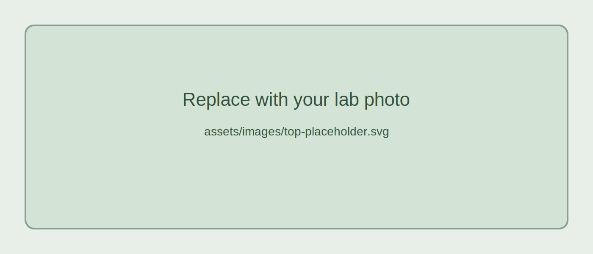

# Welcome to the Isobe Lab

We study **soil microbial ecology**, **plant–microbe interactions**, and **ecosystem processes** across natural and managed ecosystems.

{: .note }
Replace this text with a short lab introduction:
- University / department
- Main research themes
- Contact information

## News

{: .news }
**2026-03-11** Website launched.

{: .news }
**2026-03-01** New manuscript submitted.

{: .news }
**2026-02-15** We are recruiting graduate students and postdocs.

## Research highlights

### 1. Soil microbial succession
Explain one main theme of your lab here.

### 2. Plant–microbe interactions
Explain another theme here.

### 3. Biogeochemistry and ecosystem function
Explain another theme here.

## Contact

**PI:** Kazuo Isobe  
**Email:** your-email@example.com  
**Affiliation:** Your department, your university
